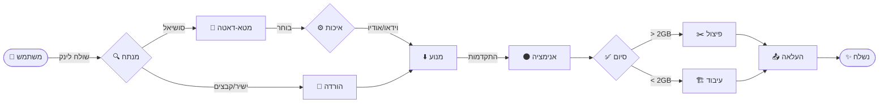

<div align="center">

# 📥 Media Downloader Bot


**בוט טלגרם אישי להורדת מדיה מפלטפורמות פופולריות והעלאה ישירה לטלגרם**

[🇮🇱 עברית](README-he.md) • [🇺🇸 English](README.md)

</div>

---

## ✨ תכונות עיקריות

| תכונה | תיאור |
|--------|--------|
| 🔗 **זיהוי אוטומטי** | מזהה את הפלטפורמה ומוריד אוטומטית |
| 🎬 **בחירת איכות** | 1080p / 720p / 480p / 360p / שמע בלבד |
| 🧲 **הורדת טורנטים** | תמיכה במגנט לינקים וקבצי .torrent (VIP) |
| 📊 **סרגל התקדמות** | מעקב בזמן אמת עם אנימציית ירח 🌑→🌕 |
| ✂️ **פיצול קבצים** | פיצול אוטומטי לקבצים מעל 2GB |
| 💳 **מערכת קרדיטים** | ניהול מכסות ותשלומים מתוך הבוט |
| 🛡️ **פאנל ניהול** | ניהול משתמשים, חסימות וקרדיטים |
| ⚡ **הורדה מהירה** | תמיכה ב-aria2 עם 16 חיבורים מקבילים |
| ❌ **כפתור ביטול** | ביטול הורדות באמצע התהליך |
| 🔄 **המשך הורדה** | אפשרות להמשיך הורדה שנכשלה |

---

## 🌐 פלטפורמות נתמכות

<div align="center">

| פלטפורמה | סטטוס | הערות |
|----------|--------|-------|
| ▶️ YouTube | ✅ | כולל פלייליסטים |
| 🎵 TikTok | ✅ | וידאו + תמונות |
| 📸 Instagram | ✅ | Reels, Stories, Posts |
| 👽 Reddit | ✅ | וידאו + אודיו |
| 📁 PixelDrain | ✅ | הורדה ישירה |
| 🦑 KrakenFiles | ✅ | הורדה ישירה |
| 🧲 Torrents | ✅ | VIP בלבד |
| 🔗 Direct Links | ✅ | כל קישור ישיר |
| 🌍 +1500 אתרים | ✅ | דרך yt-dlp |

</div>

---

## 🤖 שימוש

### 1. שלח קישור
פשוט הדבק קישור מכל פלטפורמה נתמכת (YouTube, Instagram, TikTok וכו') בצ'אט.

### 2. בחר איכות
הבוט ינתח את הקישור ויציג אפשרויות איכות (1080p, 720p, שמע בלבד).

### 3. קבל את הקובץ
הבוט מוריד, מעבד ושולח את הקובץ בחזרה אליך!

### תהליך העבודה


---

## 🎨 תכונות ממשק

### 🌙 סרגל התקדמות ירח
```
🌕🌕🌕🌕🌖🌑🌑🌑🌑🌑 45%
```

### 📊 תצוגת הורדה
```
📥 מוריד...
━━━━━━━━━━━━━━━━━━
🌕🌕🌕🌕🌖🌑🌑🌑🌑🌑 45%
📊 400MB/900MB
⚡ מהירות: 15.3MB/s
⏱️ זמן משוער: 2:30 דקות
━━━━━━━━━━━━━━━━━━
```

---

## 📁 מבנה הפרויקט

```
media-downloader-bot/
├── 📂 src/
│   ├── 📄 main.py              # נקודת כניסה + handlers
│   ├── 📄 admin.py             # פאנל ניהול
│   ├── 📂 engine/              # מנועי הורדה
│   │   ├── 📄 base.py          # מחלקת בסיס
│   │   ├── 📄 generic.py       # yt-dlp wrapper
│   │   ├── 📄 direct.py        # הורדה ישירה
│   │   ├── 📄 instagram.py     # Instagram handler
│   │   ├── 📄 tiktok.py        # TikTok handler
│   │   ├── 📄 reddit.py        # Reddit handler
│   │   ├── 📄 torrent.py       # Torrent handler
│   │   └── 📄 ...              # handlers נוספים
│   ├── 📂 database/            # מודלים ו-cache
│   ├── 📂 config/              # הגדרות
│   └── 📂 utils/               # פונקציות עזר
├── 📂 assets/                  # תמונות ואייקונים
├── 📄 requirements.txt         # תלויות Python
├── 📄 run_bot.bat              # הרצה ב-Windows
├── 📄 LICENSE                  # GPL-3.0
└── 📄 README.md                # אתה כאן! 👋
```

---

## 🛠️ דרישות מערכת

- **Python 3.10+**
- **FFmpeg** מותקן ונגיש ב-PATH
- **Telegram Bot Token** מ-@BotFather
- **Telegram API Credentials** מ-my.telegram.org

### תלויות אופציונליות

| כלי | שימוש | התקנה |
|-----|-------|-------|
| 🚀 aria2 | הורדה מהירה (16 חיבורים) | `winget install aria2.aria2` |
| 🧲 qBittorrent | הורדת טורנטים | [qbittorrent.org](https://www.qbittorrent.org/) |

---

## 🚀 התקנה

### 1. שכפל את הפרויקט
```bash
git clone https://github.com/Omer-Dahan/media-downloader-bot.git
cd media-downloader-bot
```

### 2. צור סביבה וירטואלית
```bash
python -m venv venv
venv\Scripts\activate  # Windows
source venv/bin/activate  # Linux/Mac
```

### 3. התקן תלויות
```bash
pip install -r requirements.txt
```

### 4. הגדר את קובץ `.env`
```env
# Telegram
APP_ID=your_app_id
APP_HASH=your_app_hash
BOT_TOKEN=your_bot_token
OWNER=your_telegram_id

# Database
DB_DSN=sqlite:///database.sqlite3

# Features (optional)
ENABLE_VIP=true
ENABLE_ARIA2=true
ENABLE_FFMPEG=true
```

### 5. הפעל את הבוט
```bash
python src/main.py
```

---

## 🤖 פקודות זמינות

| פקודה | תיאור |
|-------|-------|
| `/start` | התחלה והצגת תפריט ראשי |
| `/help` | עזרה ומידע נוסף |
| `/settings` | הגדרות איכות ופורמט |
| `/stats` | סטטיסטיקות שרת |
| `/buy` | רכישת קרדיטים |
| `/torrent` | הורדת טורנט (VIP) |
| `/direct` | הורדה ישירה מלינק |
| `/adminpanel` | פאנל ניהול (מנהלים) |

---

## 💳 מערכת הקרדיטים

```
1 קרדיט = 200MB
───────────────────
קובץ 400MB = 2 קרדיטים
קובץ 1GB = 5 קרדיטים
פלייליסט = סכום כל הקבצים
```

---

## 🔐 אבטחה

- 🔒 קבצי `.env`, cookies ו-sessions לא נכללים ב-Git
- 🛡️ טוקנים ונתונים רגישים מאוחסנים בצורה מאובטחת
- ⚠️ האחריות לציות לתנאי השימוש של הפלטפורמות היא על המפעיל

---

## 📜 רישיון

פרויקט זה מורשה תחת **GNU General Public License v3.0**.

כל הפצה או שינוי חייבים לעמוד בתנאי רישיון זה.

---

## 🙏 קרדיטים

פרויקט זה מבוסס על:  
**[ytdlbot](https://github.com/tgbot-collection/ytdlbot)**

הקוד עבר שינויים, הרחבות והתאמות עם תכונות נוספות ושינויים מבניים.

---

## ⚠️ הערות חשובות

> [!IMPORTANT]
> **מגבלות העלאה**: טלגרם מגבילה העלאת קבצים ל-**2GB** (4GB למנויי Premium). קבצים גדולים יפוצלו באופן אוטומטי לחלקים.

> [!WARNING]
> **זכויות יוצרים**: האחריות על התוכן המורד היא עליך בלבד. אנא כבדו את חוקי זכויות היוצרים ותנאי השימוש של הפלטפורמות השונות.

> [!NOTE]
> **ביצועים**: מהירות ההורדה תלויה בשרת המקור ובעומס הנוכחי על הבוט. משתמשי VIP מקבלים קדימות בהורדות טורנטים.

---

<div align="center">

**Made with ❤️ by Omer**

</div>
