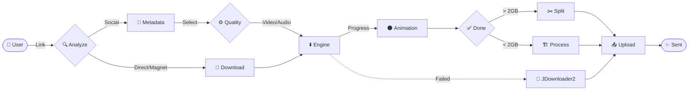

<div align="center">

# 📥 Media Downloader Bot


**Personal Telegram bot for downloading media from popular platforms and uploading directly to Telegram**

[🇮🇱 עברית](README-he.md) • [🇺🇸 English](README.md)

</div>

---

## ✨ Key Features

| Feature | Description |
|---------|-------------|
| 🔗 **Auto Detection** | Automatically detects platform and downloads |
| 🎬 **Quality Selection** | 1080p / 720p / 480p / 360p / Audio only |
| 🧲 **Torrent Downloads** | Support for magnet links and .torrent files (VIP) |
| 📊 **Progress Bar** | Real-time tracking with moon animation 🌑→🌕 |
| ✂️ **File Splitting** | Auto-split for files over 2GB |
| 💳 **Credit System** | Quota and payment management from the bot |
| 🛡️ **Admin Panel** | User management, blocks, and credits |
| ⚡ **Fast Downloads** | aria2 support with 16 parallel connections |
| ❌ **Cancel Button** | Cancel downloads mid-progress |
| 🔄 **Resume Downloads** | Resume failed downloads |
| 🔧 **JDownloader2 Fallback** | Auto-fallback to JDownloader2 for unsupported sites |
| 🔒 **Process Lock** | Lockfile mechanism to prevent duplicate bot instances |

---

## 🌐 Supported Platforms

<div align="center">

| Platform | Status | Notes |
|----------|--------|-------|
| ▶️ YouTube | ✅ | Including playlists |
| 🎵 TikTok | ✅ | Video + photos |
| 📸 Instagram | ✅ | Reels, Stories, Posts |
| 👽 Reddit | ✅ | Video + audio |
| 📁 PixelDrain | ✅ | Direct download |
| 🦑 KrakenFiles | ✅ | Direct download |
| 🧲 Torrents | ✅ | VIP only |
| 🔗 Direct Links | ✅ | Any direct link |
| 🌍 +1500 sites | ✅ | Via yt-dlp |
| 🔧 JDownloader2 | ✅ | Auto-fallback for unsupported sites |

</div>

---

## 🤖 Usage

### 1. Send media link
Simply paste a link from any supported platform (YouTube, Instagram, TikTok, etc.) into the chat.

### 2. Select Quality
The bot will analyze the link and present quality options (1080p, 720p, Audio only).

### 3. Get your file
The bot downloads, processes, and sends the file back to you!

### Workflow


---

## 🎨 UI Features

### 🌙 Moon Progress Bar
```
🌕🌕🌕🌕🌖🌑🌑🌑🌑🌑 45%
```

### 📊 Download Display
```
📥 Downloading...
━━━━━━━━━━━━━━━━━━
🌕🌕🌕🌕🌖🌑🌑🌑🌑🌑 45%
📊 400MB/900MB
⚡ Speed: 15.3MB/s
⏱️ ETA: 2:30
━━━━━━━━━━━━━━━━━━
```

---

## 📁 Project Structure

```
media-downloader-bot/
├── 📂 src/
│   ├── 📄 main.py              # Entry point + handlers
│   ├── 📄 admin.py             # Admin panel
│   ├── 📂 engine/              # Download engines
│   │   ├── 📄 base.py          # Base class
│   │   ├── 📄 generic.py       # yt-dlp wrapper
│   │   ├── 📄 direct.py        # Direct downloads
│   │   ├── 📄 instagram.py     # Instagram handler
│   │   ├── 📄 tiktok.py        # TikTok handler
│   │   ├── 📄 reddit.py        # Reddit handler
│   │   ├── 📄 torrent.py       # Torrent handler
│   │   ├── 📄 jdownloader.py   # JDownloader2 handler
│   │   ├── 📄 jdownloader_manager.py # JDownloader2 API
│   │   └── 📄 ...              # More handlers
│   ├── 📂 database/            # Models & cache
│   ├── 📂 config/              # Configuration
│   └── 📂 utils/               # Helper functions
├── 📂 assets/                  # Images & icons
├── 📄 requirements.txt         # Python dependencies
├── 📄 run_bot.bat              # Windows runner
├── 📄 LICENSE                  # GPL-3.0
└── 📄 README.md                # You are here! 👋
```

---

## 🛠️ System Requirements

- **Python 3.10+**
- **FFmpeg** installed and in PATH
- **Node.js** installed and in PATH (required by yt-dlp for YouTube signature solving)
- **Telegram Bot Token** from @BotFather
- **Telegram API Credentials** from my.telegram.org

### Optional Dependencies

| Tool | Usage | Installation |
|------|-------|--------------|
| 🚀 aria2 | Fast downloads (16 connections) | `winget install aria2.aria2` |
| 🧲 qBittorrent | Torrent downloads | [qbittorrent.org](https://www.qbittorrent.org/) |
| 🔧 JDownloader2 | Fallback for unsupported sites | [jdownloader.org](https://jdownloader.org/) |

---

## 🚀 Installation

### 1. Clone the repository
```bash
git clone https://github.com/Omer-Dahan/media-downloader-bot.git
cd media-downloader-bot
```

### 2. Create virtual environment
```bash
python -m venv venv
venv\Scripts\activate  # Windows
source venv/bin/activate  # Linux/Mac
```

### 3. Install dependencies
```bash
pip install -r requirements.txt
```

### 4. Configure `.env` file
```env
# Telegram
APP_ID=your_app_id
APP_HASH=your_app_hash
BOT_TOKEN=your_bot_token
OWNER=your_telegram_id

# Database
DB_DSN=sqlite:///database.sqlite3

# Features (optional)
ENABLE_VIP=true
ENABLE_ARIA2=true
ENABLE_FFMPEG=true

# JDownloader2 (optional)
JDOWNLOADER_EMAIL=your_jdownloader_email
JDOWNLOADER_PASSWORD=your_jdownloader_password
JDOWNLOADER_DEVICE_NAME=your_device_name
```

### 5. Run the bot
```bash
python src/main.py
```

---

## 🤖 Available Commands

| Command | Description |
|---------|-------------|
| `/start` | Start and show main menu |
| `/help` | Help and information |
| `/settings` | Quality and format settings |
| `/stats` | Server statistics |
| `/buy` | Buy credits |
| `/torrent` | Download torrent (VIP) |
| `/direct` | Direct download from link |
| `/adminpanel` | Admin panel (admins only) |

---

## 💳 Credit System

```
1 credit = 200MB
───────────────────
400MB file = 2 credits
1GB file = 5 credits
Playlist = sum of all files
```

---

## 🔐 Security

- 🔒 `.env`, cookies, and sessions are excluded from Git
- 🛡️ Tokens and sensitive data stored securely
- ⚠️ Compliance with platform ToS is the operator's responsibility

---

## 📜 License

This project is licensed under **GNU General Public License v3.0**.

Any redistribution or modification must comply with the terms of this license.

---

## 🙏 Credits

This project is based on:  
**[ytdlbot](https://github.com/tgbot-collection/ytdlbot)**

The codebase was modified, extended, and customized with additional features and structural changes.

---

## ⚠️ Important Notes

> [!IMPORTANT]
> **Upload Limits**: Telegram bots are limited to **2GB** per file (4GB for Premium users). Files larger than the limit will be automatically split into chunks.

> [!WARNING]
> **Copyright**: You are solely responsible for the content you download. Please respect copyright laws and the terms of service of the respective platforms.

> [!NOTE]
> **Performance**: Download speed depends on the source server and current bot load. VIP users get priority for torrent downloads.

---

<div align="center">

**Made with ❤️ by Omer**

</div>
